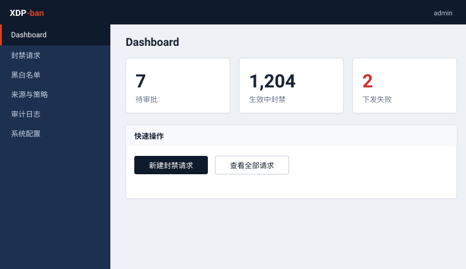

<div align="center">

# XDP-ban

**看得见,才封得下。**

一个二进制。封禁发生在内核最早的地方。

</div>

---

刀要快,更要有人按住你的手。

XDP-ban 就是那只手。你提交一次封禁,它不立刻动手 —— 停一下,让你再看一眼,
点头了,才在 **XDP** 层落下,在网卡入口,比 netfilter 更早。
一次不改的,下次封得更久;死不悔改的,永远出不来。

一个静态二进制,拷过去就能跑。没有别的。

<div align="center">
 
 
</div>

## 它做什么

- **先停一下** — 两步批准,不可改的审计,一次性邮件链接。为一个人写的:一个账号,自己提、自己批。
- **越封越久** — 累犯者刑期递增,直到永不释放。
- **只封该封的** — 按 **国家 / ASN** 圈定源,只护一台主机。下手前先算清影响面,超了配额不让过。
- **纯 XDP** — 不碰 nftables,不碰 iptables。直接写 eBPF map,走 **通用(SKB)模式**,任何网卡驱动都认。
- **答得出"网怎么断的"** — 规则天生不进 `iptables`/`nft`/`firewalld`。所以同一个二进制备了 `xdp-ban status` 和 `xdp-ban why <ip>`,直接读内核 map。你要封的源恰好盖住了自己此刻的地址?第一次提交,它会拦下你。
- **一个二进制** — 纯 Go,`CGO_ENABLED=0`,不要外部数据库,不开 HTTP API。拷了就跑。

## 两条路

控制面与执行面,住在同一个二进制里。

<div align="center">

</div>

以前它是两个:一个控制面,一个 `xdp-agent`,靠轮询 HTTP API 领命令。
现在合了。`xdp-ban` 自己加载并挂上 XDP 程序,自己对着数据库执行批准过的封禁,
不再绕一趟本地 HTTP。启动记得给 `-iface <ifname>`,它才知道往哪张网卡上挂。

有两条路,值得你逐字读:

<div align="center">
 
</div>

**左边,封禁如何诞生。** 五个决策入口 —— 四个在网页,一个在一次性邮件链接 ——
全都先过同一把进程内的锁,再进事务。那句 `UPDATE ... WHERE state='pending'`
留着当第二道防线,但单靠它,输的那一方拿到的是 500 而不是 409:
SQLite 会让延迟事务的写锁升级失败,报 `SQLITE_BUSY_SNAPSHOT`。

**右边,封禁如何生效。** 一个包,去往你从没打算保护的主机,两次查表就放行。
过没过期,由内核用 `expires_at` 比 `bpf_ktime_get_ns()` 当场定夺 —— 没有清扫线程。
于是 DB 和 map 会慢慢对不上,那道 5 分钟的对账循环,就为逮住这个漂移而活。

## 上路

下载,运行。没有依赖,不用编译 —— eBPF 已经在里面了。

```bash
# x86_64
curl -L -o xdp-ban https://github.com/githubflyideas/XDP-invisible-armor/releases/latest/download/xdp-ban-linux-amd64
# arm64: 把上面的 amd64 换成 arm64

chmod +x xdp-ban
sudo ./xdp-ban -iface eth0    # http://localhost:8080 —— 挂 XDP 要 root
```

### 那个账号

首次运行,种下一个账号。**立刻改密码** —— 它印在这份公开的 README 里。
到 **账号 / Account** 改,一改,所有会话作废,包括你自己这个。

| 用户名 | 密码 |
|---|---|
| `admin` | `admin12345` |

只有一个账号,没有用户管理。提交的人和批准的人本就是同一个,第二个角色无事可做。
`pending → approve` 那一步还在,但它给你的是一次反悔的机会,和一条把"何时申请"
与"何时生效"分开的审计线 —— 不是逼你找第二双眼睛。

要真给几个人分不同权限,把它挡在 `xdp-ban` 前面 —— 一个反代或一层独立鉴权,
网页和邮件链接一起管住,这是应用里的角色表从来做不到的。

数据只在一个 `xdpban.db` 文件里。备份 = 拷这个文件。

全部发布:https://github.com/githubflyideas/XDP-invisible-armor/releases

## 按国家 / ASN 封

```bash
curl -O https://iptoasn.com/data/ip2asn-v4.tsv.gz
XDPBAN_PREFIX_DB=./ip2asn-v4.tsv.gz ./xdp-ban
```

不给也行,别的都照跑,界面会告诉你这个功能没开。

## 排障:这些东西在 `iptables` 里一个都看不到

XDP 挂在驱动钩子上,**在 netfilter 之前**。这是它的全部意义 —— 也意味着
`iptables -L`、`nft list ruleset`、`firewall-cmd --list-all` 永远列不出一条封禁,
丢再多包也一样。若你只看这三处,一台刚封掉自己 `/24` 的主机,看着就像一场无因的断网。

同一个二进制,在控制台上答你。两条子命令都不要 `-iface`,不要守护进程活着,
什么都不写:

```bash
sudo xdp-ban status            # 内核此刻到底在拦什么
sudo xdp-ban why 203.0.113.7   # 这个地址现在被丢没被丢,是哪条规则干的
```

`status` 列出它找得到的 XDP 挂载、四个内核计数器,以及每一条 map 记录 ——
**分成活的和过期的两列**。这一分,是要害:XDP 从不删键,它拿 `expires_at`
比 `bpf_ktime_get_ns()`,过期了就放行 —— 所以"键在 map 里"不等于"这地址在被丢"。
一条生的 `bpftool map dump` 会把你引向反面。`dropped` 计数为零时它明说,
因为那句话洗清了 XDP,把你送去别处查。

`why` 拿同一个问题去问 LPM trie,内核问的也是这个 —— 查单个地址,它答得出
真正管事的那条覆盖 `/24`,而不是报一个精确匹配未命中。

两者都读 `/sys/fs/bpf/xdp-ban/` 下 pin 住的 map,那才是真相 —— 不是 SQLite,
那里只记着你"想"封什么。手边没有二进制时,
`bpftool map dump pinned /sys/fs/bpf/xdp-ban/src_ban_global` 是退路。

### 它不让你误砍自己

你提交的源范围若盖住了你此刻浏览的地址,第一次会被拦下。提示点名命中的前缀,
连从物理控制台撤销的命令一起给你,表单再回来,带一个"仍要提交"的复选框 ——
存心自封,可以;手滑打错的 `/24`,不会被默默收下。勾那个框会连同来源地址记进审计,
这是界面一旦变黑之后,唯一还活着的证据。

按国家/AS 封时最要紧:没人会去核对一个国家展开出来的四百条前缀里有没有自己 ——
所以检查跑在解析后的名单上,不是选择器上。

硬保护集(`127.0.0.0/8`、`::1/128`、`0.0.0.0/32`,加上你配的保护目标)
在这之前就查,**那个复选框顶不掉它**。

## 配置

`xdp-ban` 子命令(只读,不要 `-iface`,除了读 map 不要额外 root):

| 命令 | 干什么 |
|---|---|
| `xdp-ban status` | 内核持有的每条规则,活的对过期的,加计数器 |
| `xdp-ban why <ip>` | 那地址此刻是否在被丢,哪条规则干的 |
| `xdp-ban version` | 打印版本 |

不带子命令,就是起守护进程(网页 + 执行器)。

`xdp-ban` 参数:

| 参数 | 默认 | 干什么 |
|---|---|---|
| `-iface` | —(必填) | 挂 XDP 封禁程序的生产网卡。没有默认值 —— 悄悄跳过就等于封禁只进审计、从不拦包。 |
| `-poll-interval` | `5s` | 多久扫一次新批准的下发去执行 |

`xdp-ban` 环境变量:

| 变量 | 默认 | 干什么 |
|---|---|---|
| `XDPBAN_DB` | `xdpban.db` | SQLite 文件路径 |
| `XDPBAN_ADDR` | `:8080` | 监听地址 |
| `XDPBAN_BASE_URL` | `http://localhost:8080` | 邮件批准链接的前缀 |
| `XDPBAN_IFACE` | — | `-iface` 的替代 |
| `XDPBAN_PREFIX_DB` | — | `ip2asn-v4.tsv[.gz]` 路径;开启按国家/AS 封 |
| `XDPBAN_COOKIE_SECURE` | — | 在 TLS 后面时设任意值 |
| `XDPBAN_PPROF` | — | 设任意值暴露 `/debug/pprof`(只绑私网口) |
| `GIN_MODE` | `release` | 不设就跑 release。`GIN_MODE=debug` 找回启动时的路由清单 —— 路由不对劲时有用,平时吵。 |

## 用 systemd 部署

```bash
sudo cp xdp-ban /usr/local/bin/xdp-ban
sudo cp deploy/xdp-ban.service /etc/systemd/system/xdp-ban.service
sudo mkdir -p /var/lib/xdp-ban /etc/xdp-ban
echo 'XDPBAN_IFACE=eth0' | sudo tee /etc/xdp-ban/xdp-ban.env

sudo systemctl daemon-reload
sudo systemctl enable --now xdp-ban
```

改 `/etc/xdp-ban/xdp-ban.env`(或直接改 unit 里的 `ExecStart`)填真实网卡。
`Restart=on-failure` 崩了自己拉起;部署时 `systemctl restart xdp-ban` 发的是
`SIGTERM`,触发优雅退出(排空在途 HTTP、停执行器、卸 XDP)再收场。

map pin 在 `/sys/fs/bpf/xdp-ban/`,所以重启不掉封禁,守护进程躺着时
`xdp-ban status` 照样能用。这需要 bpffs 挂着 —— 现代 systemd 发行版都有;
没有的话,守护进程会打一条带 `mount -t bpf bpf /sys/fs/bpf` 的警告,
然后不带排障路径继续封。**宿主**重启会清空 bpffs,那道 5 分钟对账循环报告随之而来的漂移。

unit 故意不加 `ProtectSystem=strict` 那一套:它们让 `/sys` 只读,pin 直接失败,
而失败的样子是"服务起得来、`xdp-ban status` 却什么都看不到"。

## 从源码构建

只在你要动它的时候才需要 —— 发布的二进制已经把 eBPF 打包进去了。
要 `clang` 和 `libbpf-dev`。

```bash
make bpf      # clang → cmd/xdpban/obj/xdp_filter.o(go:embed 嵌入)
make build    # xdp-ban;.o 文件缺了就拒绝跑
make check    # go vet + go test -race
make release  # bpf + check + 交叉编译 linux/{amd64,arm64}
```

`.o` 是构建产物,不进 git。`make build` 会断言它非空,一个内嵌空 bytecode 的
二进制别想被误发出去。

## License

Apache-2.0。见 [LICENSE](LICENSE)。
